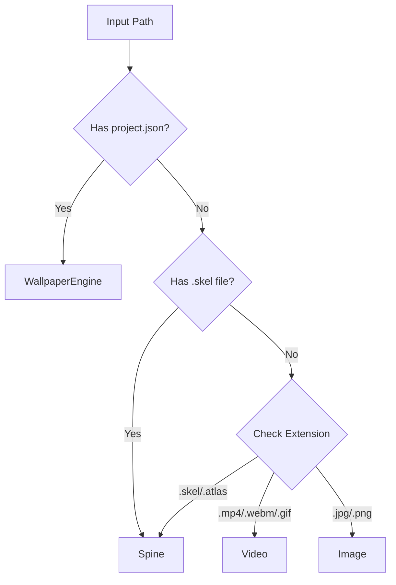

# 📖 Giải thích định dạng hình nền động

## 🎯 Tổng quan

Wallmgr hỗ trợ **3 loại hình nền động** hoàn toàn riêng biệt:

### 1️⃣ Video (+ GIF)
- **Formats**: MP4, WebM, MKV, AVI, **GIF**
- **Engine**: mpv
- **Đặc điểm**: Standalone video/GIF files

### 2️⃣ Spine
- **Formats**: .skel + .atlas + .png
- **Engine**: spine-runtime
- **Đặc điểm**: Skeletal 2D animations

### 3️⃣ Wallpaper Engine
- **Formats**: project.json + assets (mainly GIF)
- **Engine**: linux-wallpaperengine
- **Đặc điểm**: Full WE projects from Steam Workshop

---

## 🔍 Phân biệt quan trọng

### GIF - Ở đâu?

#### ✅ GIF Standalone (Type: Video)
```
/home/user/wallpapers/
└── anime-reaction.gif
```
- Render qua **mpv**
- Được phát hiện là type `video`
- Extension: `.gif`

#### ✅ GIF trong Wallpaper Engine (Type: WallpaperEngine)
```
workshop-123456/
├── project.json          ← Có file này!
└── assets/
    └── animation.gif
```
- Render qua **linux-wallpaperengine**
- Được phát hiện là type `wallpaper_engine`
- Có `project.json`

**Key:** GIF có thể ở 2 nơi, dùng 2 renderer khác nhau!

---

### Spine - Chỉ standalone

```
anime-girl/
├── character.skel    ← Required
├── character.atlas   ← Required
└── character.png     ← Required
```

**KHÔNG có `project.json`**

**Điểm đặc biệt:**
- Spine là format riêng cho skeletal animation
- **KHÔNG được dùng trong Wallpaper Engine projects**
- Wallpaper Engine chủ yếu dùng GIF, không dùng Spine

---

## 📊 Comparison Table

| Feature | Video/GIF | Spine | WE Project |
|---------|-----------|-------|------------|
| **File marker** | Extension only | .skel + no project.json | Has project.json |
| **Main format** | MP4/WebM/GIF | .skel/.atlas | GIF (mostly) |
| **Renderer** | mpv | spine-runtime | linux-wallpaperengine |
| **Can have GIF?** | ✅ Yes (main) | ❌ No | ✅ Yes (inside) |
| **Can have Spine?** | ❌ No | ✅ Yes (main) | ❌ No |
| **Complexity** | Simple | Medium | Complex |

---

## 🎨 Content Distribution

### Video files được dùng cho:
- Nature loops (ocean, forest, rain)
- City timelapses
- Movie/anime clips
- **Animated GIFs** - anime reactions, memes
- Simple animations

### Spine được dùng cho:
- Character animations (idle, breathing, blinking)
- Game character sprites
- 2D skeletal animations
- **Anime girls** with smooth movement

### Wallpaper Engine được dùng cho:
- Steam Workshop content
- Multi-layer scenes
- **GIF-based wallpapers** (most popular)
- Video + effects combinations
- Interactive wallpapers
- Particle systems

---

## 🔧 Auto-detection Flow



**Priority:**
1. Check `project.json` → WallpaperEngine
2. Check `.skel` + no `project.json` → Spine
3. Check extension → Video/Image

---

## 📝 Database Examples

```sql
-- Video wallpapers (including GIF)
INSERT INTO wallpapers (type, path) VALUES
  ('video', '/home/user/ocean.mp4'),
  ('video', '/home/user/city.webm'),
  ('video', '/home/user/anime.gif');

-- Spine animations (standalone)
INSERT INTO wallpapers (type, path) VALUES
  ('spine', '/home/user/character-animation/');

-- Wallpaper Engine projects (GIF-based)
INSERT INTO wallpapers (type, path) VALUES
  ('wallpaper_engine', '/home/user/.steam/workshop/123456/');
```

---

## 🚀 Usage Examples

### Video/GIF
```bash
# Add standalone GIF
wallmgr add ~/Downloads/anime-reaction.gif
wallmgr set ~/Downloads/anime-reaction.gif

# Add video
wallmgr add ~/Videos/ocean-4k.mp4
wallmgr set ~/Videos/ocean-4k.mp4
```

### Spine
```bash
# Add Spine directory
wallmgr add ~/Wallpapers/anime-girl/
wallmgr set ~/Wallpapers/anime-girl/

# Or point to .skel file directly
wallmgr add ~/Wallpapers/anime-girl/character.skel
```

### Wallpaper Engine
```bash
# Add WE project
wallmgr add ~/.steam/workshop/content/431960/123456789/
wallmgr set ~/.steam/workshop/content/431960/123456789/
```

---

## ⚠️ Common Mistakes

### ❌ Sai: "Wallpaper Engine dùng Spine"
**Thực tế:** Wallpaper Engine chủ yếu dùng **GIF và video**, KHÔNG dùng Spine (.skel/.atlas)

### ❌ Sai: "GIF chỉ có trong WE"
**Thực tế:** GIF có thể:
- Standalone (render qua mpv)
- Trong WE project (render qua linux-wallpaperengine)

### ❌ Sai: "Spine giống như GIF"
**Thực tế:** Spine là **skeletal animation** với bones/slots, hoàn toàn khác GIF

### ✅ Đúng: Phân biệt rõ ràng
- **GIF** = Raster animation (frame-by-frame)
- **Spine** = Skeletal animation (bones + deformation)
- **WE** = Complex projects (chủ yếu GIF-based)

---

## 📚 Technical Details

### GIF Rendering

#### Via mpv (standalone)
```bash
mpv --loop --no-audio --fps=30 animation.gif
```
- Hardware decode nếu có
- Smooth playback
- Low resource usage

#### Via linux-wallpaperengine (in WE project)
```bash
linux-wallpaperengine --dir /path/to/project
```
- Scene composition
- Layer blending
- Shader effects
- Higher resource usage

### Spine Rendering
```bash
spine-wallpaper --skeleton character.skel --fullscreen
```
- Bone-based animation
- Texture swapping
- Smooth interpolation
- Custom renderer needed

---

## 🎯 Decision Tree

```
Need animated wallpaper?
│
├─ Simple loop/GIF?
│  └─ Use: Video type (mpv)
│
├─ Character with skeletal animation?
│  └─ Use: Spine type (spine-runtime)
│
└─ Complex scene from Steam Workshop?
   └─ Use: WallpaperEngine type (linux-wallpaperengine)
```

---

## 💡 Key Takeaways

1. **GIF có 2 nơi:**
   - Standalone → type `video` → mpv
   - In WE → type `wallpaper_engine` → linux-wallpaperengine

2. **Spine là riêng biệt:**
   - Format: .skel + .atlas + .png
   - KHÔNG được dùng trong WE
   - Type: `spine`

3. **WallpaperEngine:**
   - Dấu hiệu: có `project.json`
   - Chủ yếu: GIF và video
   - KHÔNG có: .skel/.atlas

4. **Detection:**
   - `project.json` → WallpaperEngine
   - `.skel` + NO `project.json` → Spine
   - Extension → Video/Image

---

**Summary:** 3 types riêng biệt, mỗi type có format và renderer riêng. GIF được dùng ở 2 nơi (standalone và WE). Spine KHÔNG dùng trong WE.